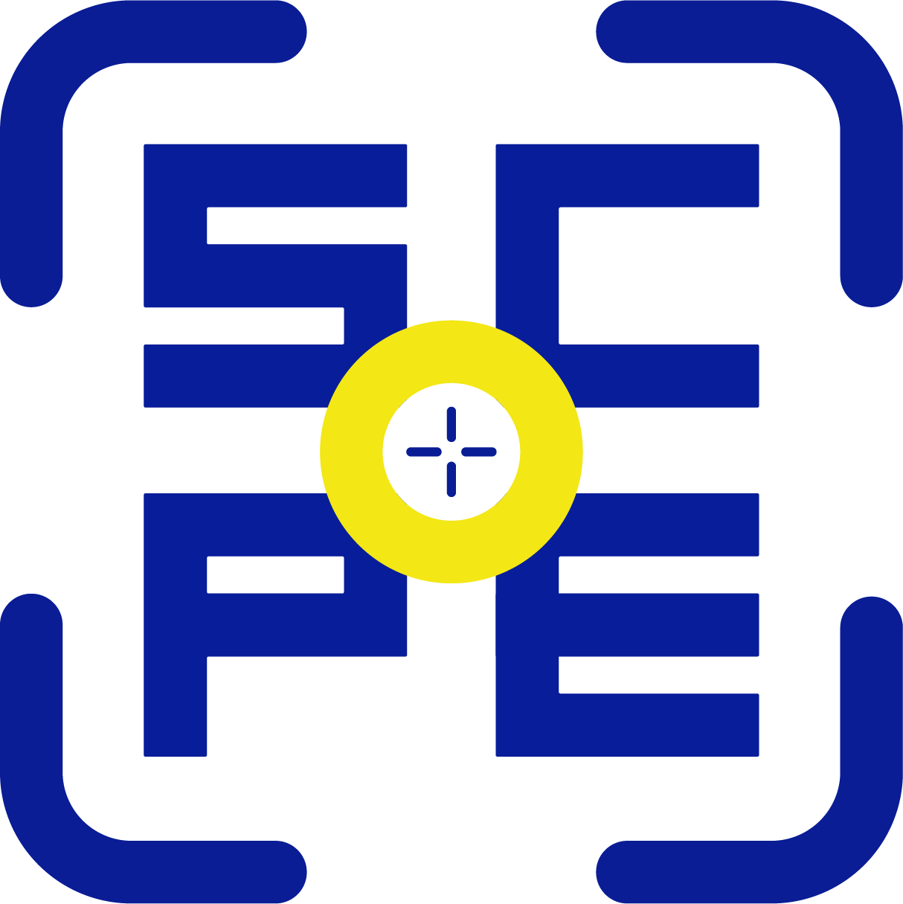

# SPINCON

**A weighted prize wheel for ICON, with a meme payoff on every win.**

Each prize gets its own chance. Land on one and the screen floods with that prize's
colour, a meme slams in with Impact captions, and confetti goes everywhere. Built for
running giveaways in front of a crowd — on a projector, a stream, or a laptop at a booth.

---

## Run it

No build step, no dependencies, no install. Open `index.html` in a browser.

Some browsers block a `file://` page from loading its sibling CSS and JS. If the page
comes up unstyled, serve the folder instead:

```bash
cd spincon
python3 -m http.server 8000
# then visit http://localhost:8000
```

Everything runs in the browser. Nothing is sent anywhere, and there's no server to keep alive.

---

## The odds are real

This matters more than it sounds. A lot of prize wheels pick the winner first and then
animate towards it, which means the slice sizes on screen are decoration.

SPINCON does the opposite:

1. A slice's **arc width is its chance**. A 3% prize is a 3% wedge.
2. Spinning picks a **uniformly random final angle** — nothing decides the outcome in advance.
3. Whatever ends up under the flapper wins.

So what the audience sees is what actually happened. Nobody can accuse you of rigging it,
and a rare prize genuinely looks rare.

Weights don't have to add up to 100. They're shared out proportionally, so `5, 3, 20, 20,
20, 7, 20` works fine — the app shows you the resulting percentages.

---

## Using it

| Action | How |
|---|---|
| Spin | **Spin it** button, the ICON hub, or the **space bar** |
| Close a meme | Space, Esc, click the backdrop, or the button |
| Edit prizes | The right-hand rail — name, weight, colour |
| Edit a meme | The 😂 button on any prize row |
| Hide all numbers | **Present mode** in the top bar |
| Mute | **Sound on / off** in the top bar |
| Keep a wheel | **Save / load** |

### Present mode

Strips every number from the screen at once — the editor rail, the odds ribbon, the
percentages printed on each slice, and the chance line on the meme card. The audience sees
prize names, the wheel, and the meme. The weights still work exactly as before; they just
aren't readable off the screen. The wheel also grows to fill the room.

### Other controls

- **Remove the winner after each spin** — raffle mode, for drawing several winners without repeats.
- **Close the meme by itself** — auto-dismisses after 6.5s. Turn it off to hold the moment.
- **Spin length** — Quick (3.2s), Classic (6.2s), Dramatic (10.5s).
- **Even odds** — flattens every weight to the same value.

---

## Editing the prizes

For a one-off session, just use the rail on the right. To change what the wheel starts with
every time, edit the `items` array at the top of `app.js`:

```js
mk("AIM STICKER", 20, "#FBC748", "🎯", "AIM STICKER SECURED", "laptop just leveled up", "memes/aim-meme.jpg")
//  name          weight  colour   emoji   top caption          bottom caption            picture
```

- **weight** — any number. Relative to the others.
- **emoji** — the fallback shown when there's no picture. Fills the meme frame at huge size.
- **top / bottom** — the Impact captions laid over the meme.
- **picture** — a path relative to `index.html`, or leave it off.

Long prize names wrap onto as many lines as they need and shrink to fit their slice, so
you don't have to keep names short.

### Meme pictures

Drop a file in `memes/` and point at it, or upload one at runtime from a prize's 😂 panel
(that route stores the image inside the page, so it travels with a **Save / load** export).

---

## Save / load

**Save / load** dumps the whole pool as JSON. Copy it somewhere safe — the app keeps nothing
between sessions, so closing the tab loses unsaved edits. Paste a saved wheel back in and
hit **Load this wheel** to swap the entire pool.

```json
[
  {
    "name": "PINS",
    "weight": 7,
    "color": "#3C8C79",
    "emoji": "📌",
    "top": "pins?? at 7%??",
    "bottom": "bag officially secured",
    "img": "memes/pins-meme.jpg"
  }
]
```

`img` takes either a path or an embedded image; `null` falls back to the emoji.

---

## Files

```
spincon/
├── index.html          markup
├── styles.css          all styling
├── app.js              wheel maths, spin, memes, editor
├── icon-color.png      the hub logo
├── icon-black.png      the top-bar badge
├── memes/              one picture per prize
└── marks/              logos drifting in the background
```

---

## Making it yours

**Colours** live as variables at the top of `styles.css`:

```css
--gold:#FBC748;  --teal:#53AE9A;  --felt:#416557;  --cream:#FBF6E9;
```

**Hub size** — how big the logo sits in the middle of the wheel:

```css
:root{ --hub: 34%; }        /* styles.css */
const hubR = size * 0.17;   /* app.js — always half the CSS value */
```

Change both or the slice labels will misjudge where to stop.

**Background marks** — the drifting logos are plain `` tags in `index.html`, each
carrying its own position, size, speed and opacity:

```html

<!--                              position   size      loop   opacity -->
```

Add one, delete one, or nudge `--o` if they're too loud or too shy on your screen. To swap
in a different org's logo, drop a transparent PNG in `marks/` and point at it.

---

## Notes

- Works on phones — the rail stacks under the wheel.
- Respects `prefers-reduced-motion`: shorter spins, frozen background, no screen shake.
- Sound is synthesised in the browser (WebAudio), so there are no audio files to ship.
- Nothing persists between sessions by design. Use **Save / load**.

Made for ICON.
